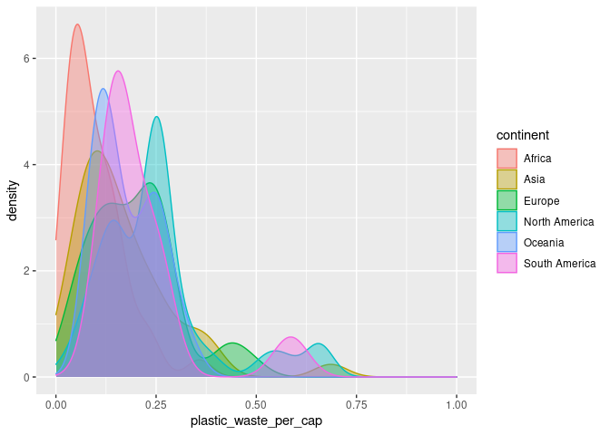

Lab 02 - Plastic waste
================
Ella Beiser
January 27, 2022

## Load packages and data

``` r
library(tidyverse) 
```

``` r
plastic_waste <- read_csv("data/plastic-waste.csv")
```

## Exercises

``` r
plastic_waste <- read_csv("data/plastic-waste.csv")
```

    ## Rows: 240 Columns: 10

    ## ── Column specification ────────────────────────────────────────────────────────
    ## Delimiter: ","
    ## chr (3): code, entity, continent
    ## dbl (7): year, gdp_per_cap, plastic_waste_per_cap, mismanaged_plastic_waste_...

    ## 
    ## ℹ Use `spec()` to retrieve the full column specification for this data.
    ## ℹ Specify the column types or set `show_col_types = FALSE` to quiet this message.

``` r
ggplot(data = plastic_waste, aes(x = plastic_waste_per_cap)) +
  geom_histogram(binwidth = 0.2)
```

    ## Warning: Removed 51 rows containing non-finite values (stat_bin).

<!-- -->

``` r
plastic_waste %>%
  filter(plastic_waste_per_cap > 3.5)
```

    ## # A tibble: 1 × 10
    ##   code  entity              continent  year gdp_per_cap plastic_waste_p… mismanaged_plas…
    ##   <chr> <chr>               <chr>     <dbl>       <dbl>            <dbl>            <dbl>
    ## 1 TTO   Trinidad and Tobago North Am…  2010      31261.              3.6             0.19
    ## # … with 3 more variables: mismanaged_plastic_waste <dbl>, coastal_pop <dbl>,
    ## #   total_pop <dbl>

Trinidad and Tobago produce the most waste per capita per day in the
world according to a report by Forbes. Additionally, their waste is
improperly managed and likely to end up in the ocean.

### Exercise 1

The density plot below shows that the majority of countries in Africa
have very low plastic waste per capita with the majority producing 0.1
kilograms per capita. In contrast, Europe has a wide range of plastic
waste production with the majority ranging from 0.15-0.27 kilograms per
capita. The plot also indicates that each continent has a number of
outliers who produce significantly more plastic waste per capita than
the rest.

``` r
#Below is a histogram of plastic waste faceted
ggplot(data = plastic_waste, aes(x = plastic_waste_per_cap)) +
  geom_histogram()
```

    ## `stat_bin()` using `bins = 30`. Pick better value with `binwidth`.

    ## Warning: Removed 51 rows containing non-finite values (stat_bin).

<!-- -->

``` r
#Below is a density plot with color!
ggplot(data = plastic_waste, 
       mapping = aes(x = plastic_waste_per_cap, 
                     color = continent, 
                     fill = continent)) +
  geom_density(alpha = 0.7)
```

    ## Warning: Removed 51 rows containing non-finite values (stat_density).

<!-- -->

### Exercise 2

``` r
ggplot(data = plastic_waste, 
       mapping = aes(x = plastic_waste_per_cap, 
                     color = continent, 
                     fill = continent)) +
  geom_density(alpha = 0.4) +
  xlim(0, 1)
```

    ## Warning: Removed 52 rows containing non-finite values (stat_density).

<!-- -->

### Exercise 3

The color and fill of the curves are defined by the mapping aesthetic
because they are dependent on the data and it is not consistent across
the board. In contrast, the alpha level is a characteristic of the
plotting geom because the alpha is a consistent level for the entire
plot.

``` r
ggplot(data = plastic_waste, 
       mapping = aes(x = continent, 
                     y = plastic_waste_per_cap)) +
  geom_boxplot()
```

    ## Warning: Removed 51 rows containing non-finite values (stat_boxplot).

<!-- -->

### Exercise 4

Remove this text, and add your answer for Exercise 4 here.

``` r
# insert code here
```

### Exercise 5

Remove this text, and add your answer for Exercise 5 here.

``` r
# insert code here
```

### Exercise 6

Remove this text, and add your answer for Exercise 6 here.

``` r
# insert code here
```

### Exercise 7

Remove this text, and add your answer for Exercise 7 here.

``` r
# insert code here
```

``` r
# insert code here
```

### Exercise 8

Remove this text, and add your answer for Exercise 8 here.

``` r
# insert code here
```
